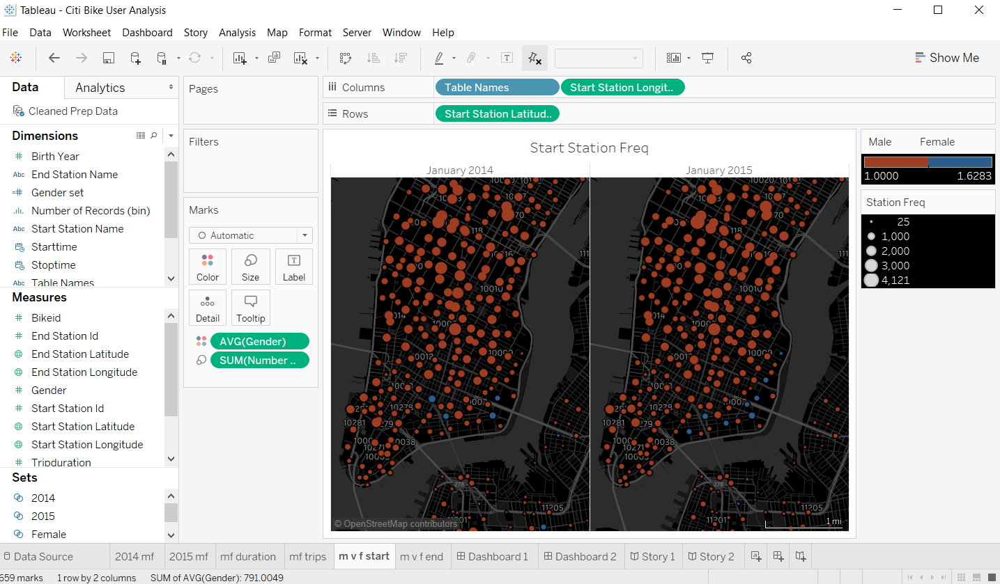

# Citi Bike Analytics

## Background

Congratulations on your new job! As the new lead analyst for the [New York Citi Bike](https://en.wikipedia.org/wiki/Citi_Bike) Program, you are now responsible for overseeing the largest bike sharing program in the United States. In your new role, you will be expected to generate regular reports for city officials looking to publicize and improve the city program.

Since 2013, the Citi Bike Program has implemented a robust infrastructure for collecting data on the program's utilization. Through the team's efforts, each month bike data is collected, organized, and made public on the [Citi Bike Data](https://www.citibikenyc.com/system-data) webpage.

However, while the data has been regularly updated, the team has yet to implement a dashboard or sophisticated reporting process. City officials have a number of questions on the program, so your first task on the job is to build a set of data reports to provide the answers. 

## Summary (with links to my code and results)
 
* Use Tableau to create a report using a dataset you've created using aggregated [NY Citi Bike history logs](https://www.citibikenyc.com/system-data). Clean and prep the data before merging the Citi Bike system data files in Tableau. To facilitate each request, generate a worksheet to answer the inquiries detailed below.  Sum up the information is a final report that contains [Charts](Images/User_Activity_Charts.png) and [Maps](Images/User_Activity_Map.png) that depict how user activity changes over time.  

## Task

**Aggregate the data found in the Citi Bike Trip History Logs to build a data dashboard, story, and a report. This will require cleaning and merging multiple datasets from different periods. The following are some questions you that can be answered using the dashboard**

* How many trips have been recorded total during the chosen period (Male vs. Female)?

* By what percentage has total ridership grown (Male vs. Female)?

* Today, what is the gender breakdown of active participants (Male vs. Female)?

* How does the average trip duration change by gender during the chosen period?

* What is the average distance in miles that a bike is ridden for males vs. females?

* Are there any observable trends in station usage among males and females?

**Additionally, city officials would like to see the following visualizations:**

* A static map that plots all bike stations with a visual indication of the most popular locations to start and end a journey with zip code data overlaid on top.

* A dynamic map that shows how each station's popularity changes over time (by month and year) -- with commentary pointing to any interesting events that may be behind these phenomena.

## Considerations

* Remember, the people reading your analysis will NOT be data analysts. Your audience will be city officials, public administrators, and heads of New York City departments. Your data and analysis needs to be presented in a way that is focused, concise, easy-to-understand, and visually compelling. Your visualizations should be colorful enough to be included in press releases, and your analysis should be thoughtful enough for dictating programmatic changes. Analytic rigor, readability, and visual attraction are key metrics in determining how your findings are receieved.

* You may need to get creative in how you combine each of the CSV files. Don't just assume Tableau is the right tool for the job. CSV formats will vary between each file. Subtle changes to the formats in any of your columns can blockade your analysis. Ensure your data is consistent and clean throughout your analysis. (Hint: Start and End Time change at some point in the history logs).

* Since this is a project for the city, spend the appropriate time thinking through decisions on color schemes, fonts, and visual story-telling. The Citi Bike program has a clear visual footprint. As a suggestion, look for ways to have your data visualizations match their aesthetic tones.